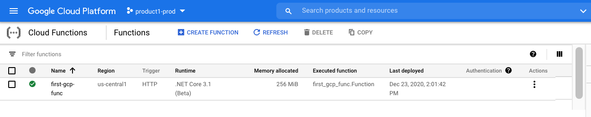

# gcp-dotnet-cloudfunction
Dependent on [dotnet sdk version 3.1.402](https://dotnet.microsoft.com/download/dotnet-core/3.1)

## Steps as of December 23, 2020
- Install compatible [SDK](https://dotnet.microsoft.com/download/dotnet-core/3.1)
- Make project directory
```bash
mkdir my-first-gcp-func
cd my-first-gcp-func
```
- Create [global.json](./global.json) in Project directory created above dotnet looks in current working directory first for version and global config
```bash
touch global.json
nano global.json
```
- Edit [global.json](./global.json)
```json
{
  "sdk": {
    "version": "<SUPPORTED DOTNET VERSION>"
  }
}
```
- Install Google Cloud Functions templates (as of date above dependent on version 3.1)
```bash
dotnet new -i Google.Cloud.Functions.Templates::1.0.0-beta04
```
- Create Project
```bash
dotnet new gcf-http 
```
- Run
Follow above steps in cli then open cs.proj in Visual Studio on Mac. Process should just work inside VS Code. This builds local Kestrel web server listening on 8080 just like the public Cloud Function url will. So local dev should be identical to deployment.
```bash
dotnet run
```

## Deploy
You can see the steps inside [Build.ps1](./Build.ps1)
The nice thing is the gcloud functions deploy command takes care of zipping up our function code/project and uploading it to Google Cloud Storage within the same project as the function. 

## Example Invocation 
[This](./request.ps1) method of invocation leverages the current auth token within context of user or tool to make function call. Not only is the endpoint secured via Authentication but you can also leverage authorization with built in IAM. In this pattern we would save the SA key that the user/tool is using to invoke the lambda inside Secrets Manager. Granting only those who need access to it the roles/secretmanager.secretAccessor role. 
- Authentication 
  - Implemented on function during deployment out of the box. You have to explicitly allow public access if you so choose by providing the following flag:
  ```bash
  --allow-unauthenticated
  ```
- Authorization
  - Achieved by only allowing certain users/tools the ability to read from secrets manager.

## Google Cloud Function using Dotnet 


## References 
- [Functions-Framework](https://github.com/GoogleCloudPlatform/functions-framework-dotnet)
